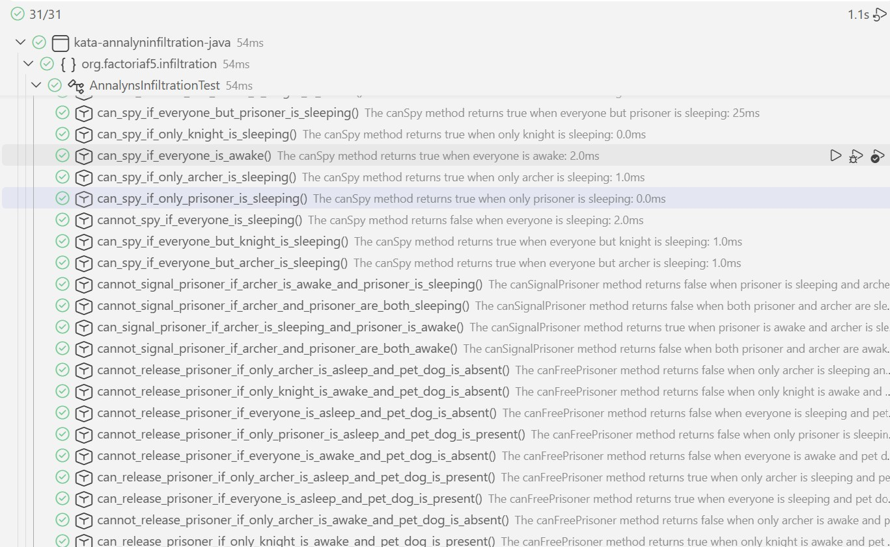

# Annalyn's Infiltration

## Description

This exercise is part of the Factoría F5 bootcamp. The objective is to implement the quest logic for a new RPG game that a friend is developing.

The game's main character is Annalyn, a brave girl with a fierce and loyal pet dog. Unfortunately, disaster strikes: her best friend is kidnapped while searching for berries in the forest. Annalyn will try to find and free her friend, optionally taking her dog with her on the quest.

After some time spent following her best friend's trail, she finds the camp in which her best friend is imprisoned. It turns out there are two kidnappers: a mighty knight and a cunning archer.

Having found the kidnappers, Annalyn considers which of the following actions she can take:

- **Fast attack:** A fast attack can be made if the knight is sleeping because it takes time for him to put on his armor, leaving him vulnerable.

- **Spy:** The group can be spied upon if at least one of them is awake. Otherwise, spying is a waste of time.

- **Signal the prisoner:** The prisoner can be signaled using bird sounds if the prisoner is awake and the archer is sleeping. Archers are trained in bird signaling, so an awake archer could intercept the message.

- **Free the prisoner:** Annalyn can try to sneak into the camp to free the prisoner. This is risky and can only succeed in one of two ways:

  - If Annalyn has her pet dog with her, she can rescue the prisoner if the archer is asleep. The knight is afraid of the dog, and the archer will not have time to get ready before Annalyn and the prisoner escape.
  - If Annalyn does not have her dog, she and the prisoner must be very sneaky. Annalyn can free the prisoner if the prisoner is awake and both the knight and archer are sleeping. If the prisoner is sleeping, Annalyn cannot rescue them because her sudden appearance would startle the prisoner and wake the knight and archer.

You have four tasks: implement the logic that determines whether the actions above are available based on the state of the three characters and whether Annalyn's pet dog is present.

## 1. Check if a fast attack can be made

Implement the static `AnnalynsInfiltration.canFastAttack()` method, which takes a `boolean` value indicating whether the knight is awake. The method returns `true` if a fast attack can be made based on the knight's state. Otherwise, it returns `false`:

```java
boolean knightIsAwake = true;
AnnalynsInfiltration.canFastAttack(knightIsAwake);
// => false
```

## 2. Check if the group can be spied upon

Implement the static `AnnalynsInfiltration.canSpy()` method, which takes three `boolean` values indicating whether the knight, archer, and prisoner are awake, respectively. The method returns `true` if the group can be spied upon based on the state of the three characters. Otherwise, it returns `false`:

```java
boolean knightIsAwake = false;
boolean archerIsAwake = true;
boolean prisonerIsAwake = false;
AnnalynsInfiltration.canSpy(knightIsAwake, archerIsAwake, prisonerIsAwake);
// => true
```

## 3. Check if the prisoner can be signaled

Implement the static `AnnalynsInfiltration.canSignalPrisoner()` method, which takes two `boolean` values indicating whether the archer and prisoner are awake, respectively. The method returns `true` if the prisoner can be signaled based on the state of the two characters. Otherwise, it returns `false`:

```java
boolean archerIsAwake = false;
boolean prisonerIsAwake = true;
AnnalynsInfiltration.canSignalPrisoner(archerIsAwake, prisonerIsAwake);
// => true
```

## 4. Check if the prisoner can be freed

Implement the static `AnnalynsInfiltration.canFreePrisoner()` method, which takes four `boolean` values. The first three parameters indicate whether the knight, archer, and prisoner are awake, respectively. The last parameter indicates whether Annalyn's pet dog is present. The method returns `true` if the prisoner can be freed based on the state of the three characters and the presence of Annalyn's dog. Otherwise, it returns `false`:

```java
boolean knightIsAwake = false;
boolean archerIsAwake = true;
boolean prisonerIsAwake = false;
boolean petDogIsPresent = false;
AnnalynsInfiltration.canFreePrisoner(knightIsAwake, archerIsAwake, prisonerIsAwake, petDogIsPresent);
// => false
```

### Source

- [Annalyn's Infiltration on Exercism](https://exercism.org/tracks/java/exercises/annalyns-infiltration)

## Deliverables
- Screenshot of the VS Code "Testing" section showing the test results.


